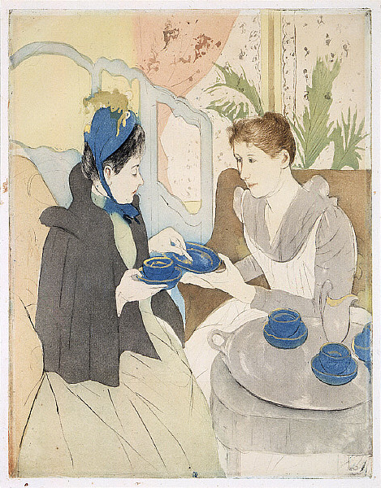

<style>
body {
text-align: justify}
</style>


```{r setup, include=FALSE, results='hide', warning=FALSE}
library(knitr)
opts_chunk$set(cache = FALSE,
               echo = TRUE,
               message = FALSE,
               warning = FALSE,
               dpi = 300)  
``` 

```{marginfigure}

```

Ce document sert d'introduction au mode d'inférence qu'est la *randomization inference*. Comme example illustratif, nous utilisions le jeu de données utilisée dans le manuel *Experimental Design: A Randomization-Based Perspective*, qui est en cours de publication, de Tirthankar Dasgupta and Donald B. Rubin. Si vous trouvez la moindre erreur ou avez des questions, n'hésitez pas à me contacter à  leo.zabrocki@gmail.com.

# Chargement des packages

Nous allons utiliser principalement les packages du Tidyverse pour la manipulation et la visualisation des deonnées. Nous utilisons aussi le package `RcppAlgos` qui permet de calculer très rapidement la matrice de l'ensemble des allocations possibles du traitement.

```{r}
library(here) # for file paths management
library(knitr) # for generating dynamic report
library(tidyverse) # for data manipulation and visualization
library(RcppAlgos) # for computing permutations matrix
library(Cairo) # for printing external fonts
source(here::here("script_theme_tufte.R")) # custom ggplot theme
```


# Intuition : The Lady Tea Testing Experiment

```{marginfigure}

```

Pour comprendre l'intuition de la randomization inference, nous allons reprendre une expérience célèbre menée par Fisher et qui peut être résumée par la citation suivante :

> "Dr. Muriel Bristol, a colleague of Fisher’s, claimed that when drinking tea she could distinguish whether milk or tea was added to the cup first (she preferred milk first). **To test her claim, Fisher asked her to taste eight cups of tea, four of which had milk added first and four of which had tea added first.**" --- Agresti, Categorical Data Analysis, p.91

Si la Dr. Muriel Brisol ne fait que devenir au hasard, quelle est la probabilité qu'elle devine correctement pour chaque tasse ? Si vous étiez fort en combinatoires, vous pourriez résoudre ce problème avec une formule. Ici, on va à la place tester cette hypothèse à l'aide de simulations ! Résoudre des problèmes d'inférence avec des simultations est une approche très puissante car il n'y a pas forcément de formules mathématiques disponibles pour chaque problème. 


Dans cette expérience, Fisher a donc préparé 8 tasses identiques. Dans quatre tasses choisies au hasard, il a versé du lait puis le thé. Dans les quatre restantes, il a versé du thé puis du lait. Il a ensuite demandé au Dr. Muriel Brisol de classer huit les tasses - à sa grande suprise, elle a correctement déviné. Nous pouvons résumer cette expérience avec le tableau suivant :


```{r, echo = FALSE}
tibble(Cups = 1:8, "Lady's Guess" = c("M" ,"T" ,"T" ,"M" ,"M" ,"T" ,"T" ,"M" ), "Actual Order" = c("M" ,"T" ,"T" ,"M" ,"M" ,"T" ,"T" ,"M" ), "Scenarios" = c("TTT...", "TTM...", "TTM...", "TMM...", "MMT...", "MMT...", "MTM...", "MMT...")) %>% kable(., align=c("l", 'c', "c", "c"))
```

Dans la première colonne, nous avons l'identifiant des 8 cups. Dans la seconde, la réponse du Dr. Muriel Brisol et dans la troisème la vraie réponse. Nous allons simuler des réponses pour voir quelle est la probabilité d'avoir tout juste lorsqu'on devine au hasard. Pour chaque simulation, nous compterons le nombre de bonnes réponses pour obtenir la distribution des réponses justes produites par le hasard. Comment peut-on faire cela avec R ?

On enregistre d'abord un vector des réponses de la lady :

```{r}
lady_guess <- c("M" ,"T" ,"T" ,"M" ,"M" ,"T" ,"T" ,"M" )
```

On va ensuite faire une boucler pour simuler 1000 réponses aléatoires et compter le nombre de réponses correctes.

```{r}
# vecteur pour enregistrer les résultats des simulations
correct <- rep(NA, 1000)
# on lance 1000 simulations
for (i in 1:1000){
# vecteur de réponses aléatoires
  random_guess <- sample(c(rep("T", 4), rep("M", 4)), replace = FALSE)
# on enregistre le nombre de bonnes réponses
  correct[i] <- sum(lady_guess == random_guess)
} 
```

Nous traçons enfin la distribution du nombre bonnes réponses lorsqu'on devine au hasard :

```{r, fig.height=5, fig.width=8}
# la table de données
data_simulations <- tibble(n_correct_guess = correct)

# le graph
ggplot(data_simulations, aes(x = n_correct_guess)) +
  geom_density(color = "white", fill = "deepskyblue3", alpha = 0.8) +
  geom_vline(xintercept = mean(data_simulations$n_correct_guess), color = "black") +
  geom_vline(xintercept = 8, color = "coral") +
  ggtitle("Distribution de bonnes réponses sous le hasard") +
  xlab("Nombre de réponses correctes") + ylab("Compte") +
  theme_tufte()
```

Nous voyons que si nous devinons au hasard, nous aurons en moyenne 4 bonnes réponses justes (ligne noire). La ligne rouge représente le nombre de bonnes réponses du Dr. Muriel Brisol : nous pouvons voir qu'il y a peu de chance d'obtenir 8 bonnes réponses en devinant au hasard. Avec R, nous pouvons calculer la probabilité d'obtenir 8 bonnes réponses au hasard :

```{r}
mean(data_simulations$n_correct_guess == 8)*100
```

Seulement ``r mean(data_simulations$n_correct_guess == 8)*100` des devinettes au hasard ont eu 8 réponses justes. On peut donc se dire que le Dr. Muriel Brisol est vraiment douée... et que sa réponse n'est *a priori* pas due au hasard ! Bien que simple, cet exemple permet de comprendre d'où provient l'inférence statistique.

# Les bases de la randomization inference

## La théorie derrière ce mode d'inférence

Qu'est-ce que la Randomization Inference (RI) ? On va utiliser l'acte d'attribuer aléatoirement un traitement comme fondement de notre inférence. Comme l'a dit Fisher, l'allocation aléatoire est la "reasoned basis for inference". Fisher voulait utiliser ce mode d'inférence mais les moyens de calculs de l'époque n'étaient pas assez puissants. Heureusement, vous pouvez aujourd'hui faire des simulations assez ambitieuses sur vos ordinateurs.

La randomization inference sert à tester une hypothèse **très** forte : le traitement n'a aucun effet pour chaque unité. On nomme souvent cette hypothèse la **sharp null hypothesis**. Cette hypothèse peut sembler assez irréaliste pour de nombreuses expériences : même si le traitement est inefficace, il est assez probable qu'il ait au moins un effet pour certaines unités. Le statisticien Donald Rubin explique que c'est quand même une hypothèse utile à tester car si on n'arrive pas à la rejeter, ça implique que votre traitement est vraiment inefficace. Un des autres avangates de la RI est que vous pouvez faire de l'inférence sans vous reposer sur la théorie statistique qui propose des résultats asymptotiques (pour une taille d'échantillon qui tend vers l'infini) et assumant certaines formes de distribution (par exemple, la loi normale).

Formellement, la sharp null hypothesis of no effect est :

$\forall i, H_{0} : \tau_{i} = Y_{i}(1) - Y_{i}(0) = 0$

Les Y(1) de chaque unité sont égaux à leurs Y(0). Cette hypothèse nulle va ainsi permettre d'imputer les potential outcomes manquants.

Prenons l'exemple fictif d'une expérience agricole proposé par Tirthankar Dasgupta and Donald B. Rubin. Deux engrais, un nouveau et un ancien, sont alloués aléatoirement sur $N = 11$ champs. $N_{T} = 6$ champs reçoivent le nouvel engrais et sont les unités traités. Les $N_{C} = 5$ autres champs reçoivent l'ancienne version et sont les unités de contrôle. Pour chaque champ, nous observons le rendement en tomates (en livres) qui est mesuré à la fin de l'expérience. 

Voici le code pour créer les données de l'expérience :

```{r}
# create the data
data <- tibble(
    w = c(0, 0, 1, 1, 0, 1, 1, 1, 0, 0, 1),
    yield = c(29.2, 11.4, 26.6, 23.7, 25.3, 28.5, 14.2, 17.9, 16.5, 21.1, 24.3)
  )
```

Nous pouvons ensuite afficher la table de Science, c'est-à-dire la table qui contient pour chaque unité, son indice, son allocation au traitement, nos informations sur deux outcomes potentiels ainsi que son outcome observé. La voici :

```{r, echo = FALSE}
data %>%
  mutate("Y(0)" = ifelse(w==0, yield, "?"),
         "Y(1)" = ifelse(w==1, yield, "?")) %>%
  rename(W = w, "Observed Yield" = yield) %>%
  select(W, "Y(0)", "Y(1)", "Observed Yield") %>%
  kable(., align = rep("c", 4))
```

Nous allons maintenant analyser le résultat de cette expérience avec la RI.

## Tester la sharp null hypothesis avec R

Avant de calculer l'estimate pour l'effet du traitement, il faut d'abord calculer le nombre d'allocation possible du traitement. Comme nous sommes dans le cas d'une expérience complète, ce nombre est donné par la formule suivant :

\begin{center}
$\frac{N!}{N_{T}!N_{C}!}$
\end{center}

Nous pouvons calculer ce nombre avec R:

```{r}
n_allocations <- factorial(11)/(factorial(5)*factorial(6))

n_allocations
```

Il y a donc 462 allocations possibles du traitement ! Nous pouvons calculer la matrix de l'ensemble de ces permutations avec le code suivant :

```{r}
permutations_matrix <- RcppAlgos::permuteGeneral(c(0,1), 11, freq = c(5,6)) %>%
  t()
```

Il faut ensuite choisir une "test statistic". Par exemple, nous pouvons prendre la différence moyenne de rendement entre les groupes de traitement et de contrôle :

```{r}
# compute observed test statistic
diff_obs <- mean(data$yield[data$w==1]) - mean(data$yield[data$w==0])

# display the value
diff_obs
```

Les champs traités ont en moyenne un rendement supérieur de 1.8 livres. Une fois que nous avons enregistré la valeur de la test statistic observée dans nos données, nous devons imputer les potential outcomes à l'aide de la sharp null hypothesis. Il faudrait créer deux nouvelles colonnes, Y(0) et Y(1). une fois ces deux colonnes créées, il suffirait de réallouer de manière aléatoire le traitement, experimer l'outcome observé à l'aide la formule $Y_i = Y_i(0)\times (1-W_i) + Y_i(1)\times W_i$ et calculer la valeur de la test statistic. Pour aller plus vite au niveau de la programmation, nous pouvons juste mélanger la variable de traitement et calculer la test statistic à partir des outcomes observés. Je vous montre ci-dessous comment calculer une nouvelle valeur de la test statistic selon une autre allocation du traitement :

```{r, eval = TRUE}
# nouvelle allocation aléatoire
data %>%
  mutate(w_new = sample(w, replace = FALSE)) %>%
  summarise(diff_new = mean(yield[w_new==1]) - mean(yield[w_new==0]))
```

Pour construire la distribution de la test statistic sous la sharp null hypothesis, il suffit ensuite de faire de calculer l'ensemble des valeurs possibles de la test statistic à l'aide la matrice d'allocation du traitement :
  
```{r}
# randomization distribution
randomization_distribution = NULL
n_columns = dim(permutations_matrix)[2]
for (i in 1:n_columns) {
  permuted_test_statistic = mean(data$yield[permutations_matrix[, i] == 1]) - mean(data$yield[permutations_matrix[, i] == 0])
  randomization_distribution[i] = permuted_test_statistic
}
```

Une fois que la boucle a tourné, nous pouvons tracer la distribution de la test statistic : 

```{r, fig.height=5, fig.width=8}
data_randomization_distribution <-
  tibble(diff_sim = randomization_distribution) 

ggplot(data_randomization_distribution, aes(x = diff_sim)) +
  geom_histogram(color = "white", fill = "deepskyblue3", alpha = 0.8) +
  geom_vline(xintercept = mean(data_randomization_distribution$diff_sim), color = "black") +
  geom_vline(xintercept = diff_obs, color = "coral") +
  ggtitle("Distribution de la test statistic sous la sharp null hypothesis") +
  xlab("Différences simulées") + ylab("Compte") +
  theme_tufte()
```

Sur ce graphique, nous pouvons voir la distrubtion de la test statistic sous la sharp null hypothesis. La ligne noire représente la moyenne des simulations. En rouge, nous avons la valeur de la test statistic réellement observée pour l'expérience : il semblerait que, sous la sharp null hypothesis, il est très probable d'obtenir la valeur observée de la test statistic. Généralement, les chercheurs calculent alors une **p-value** pour savoir s'ils doivent rejeter l'hypothèse nulle. La p-value est la probabilité d'observer des valeurs aussi extrêmes ou plus que celle de votre *test statistic* sous **l'hypothèse nulle**. Il y a deux façons de calculer une p-value. Nous pouvons d'abord calculer la probabilité d'observer une test statictic plus grande que celle que nous observons à partir des valeurs brutes des test statistic simulées : cela représente la proportion des valeurs qui se trouvent à droite de la droite rouge. C'est ce qu'on nomme une **one-sided p-value**. Cependant, les chercheurs ne savent pas forcément où va se situer la test statistic par rapport à sa distribution. Il faudrait prendre en compte à la fois la proportion à droite de la ligne rouge mais aussi à gauche du symmétrique de cette ligne par rapport à l'axe x = 0. Pour calculer cette **two-sided p-value**, il suffit alors de prendre les valeurs absolues des différences simulées. Si le concept de **p-value** vous semble flou, c'est normal : les explications des statistitiens pour expliquer la différence entre ces deux types de p-value sont souvent confuses. Avec R, nous pouvons calculer les deux **p-values** avec les codes suivants: 

```{r, eval = TRUE}
# one-sided p-value
(sum(data_randomization_distribution$diff_sim >= diff_obs)/n_allocations)

# two-sided p-value
(sum(abs(data_randomization_distribution$diff_sim) >= diff_obs)/n_allocations)
```

Nous pouvons voir que les deux p-values sont très faibles : il semblerait donc que nous ne pouvons pas rejeter la sharp null hypothesis.

# Bibliography


