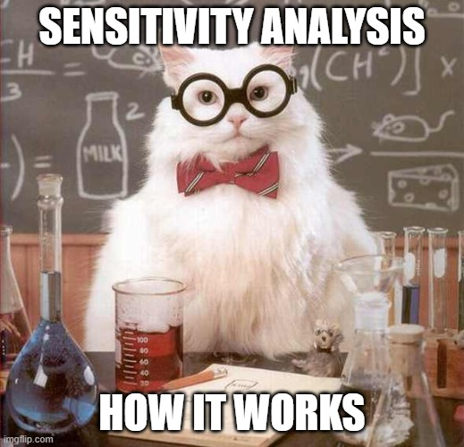
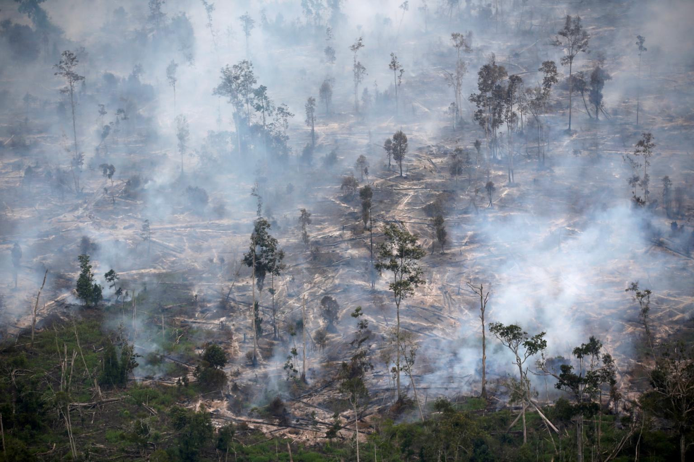

<style>
body {
text-align: justify}
</style>


```{r setup, include=FALSE, results='hide', warning=FALSE}
library(knitr)
opts_chunk$set(cache = FALSE,
               echo = TRUE,
               message = FALSE,
               warning = FALSE,
               dpi = 300)  
``` 

```{marginfigure}

```

In your metrics courses, you must have realized that economists are obsessed with omitted variable bias. Identification strategies based on instrumental variable, difference-in-differences and regression discontinuity can help limit this threat. Even when researchers exploit convincing sources of identification, they often adjust for confounding variables to make their results even more credible and discuss why there are no unmeasured confounders or that they are not going to alter the results. The potential impact of omitted variables is however rarely quantified. In this tutorial, we will see how to implement the new method of sensitivity analysis (also called quantitative bias analysis) developed by [Carlos Cinelli and Chad Hazlett (2020)](https://rss.onlinelibrary.wiley.com/doi/full/10.1111/rssb.12348?casa_token=HNY1T0j24BUAAAAA%3A3vZZLJEzMVxklHFC6ZM_FkUqpcW26LW_CMPl1iiY_MiPOmWw-DRwU051oNpTl4e6-H53Wt_CFvxFgw). Here, I am following closely their [great tutorial](https://papers.ssrn.com/sol3/papers.cfm?abstract_id=3588978) for implementing their method in R.

The goal of a sensitivity is *"to quantify how strong unobserved confounding needs to be in order to substantially change a research conclusion"*. Different methods have been proposed by statisticians but they have not been adopted since they can rely on strong assumptions or do not easily correspond to the types of analysis researchers are used to do. In their paper, [Carlos Cinelli and Chad Hazlett (2020)](https://rss.onlinelibrary.wiley.com/doi/full/10.1111/rssb.12348?casa_token=HNY1T0j24BUAAAAA%3A3vZZLJEzMVxklHFC6ZM_FkUqpcW26LW_CMPl1iiY_MiPOmWw-DRwU051oNpTl4e6-H53Wt_CFvxFgw) overcome these limits. Their method allows to:

1. *"Assess the sensitivity of point estimates, t-values, and confidence intervals"* in a regression framework. As economists and other social scientists love regressions, this is very important for this method to be widely adopted.
2. *"Easily assess the sensitivity of multiple confounders acting together, possibly non-linearly".*
3. *"Exploit knowledge of the relative strength of variables to posit plausible bounds on unobserved confounding".*
4. *"Construct a set of summary sensitivity statistics suitable for routine reporting."*

We will first briefly review the intuition behind the method developed by the authors. We then implement it in R using a study by Hazlett (2019) on the effects of exposure to violence on attitudes towards peace, in Darfur, Sudan. Finally, we test this method on a study by Tamara L. Sheldon and Chandini Sankaran (2017) on the impact of Indonesian forest fires on Singaporean pollution and health.

Should you find any errors and have any remarks, do not hesitate to reach me at leo.zabrocki@gmail.com.

# Loading Packages

To build the document and reproduce the analysis, the following packages are required: 

```{r}
library(here) # for file paths management
library(knitr) # for generating dynamic report
library(tidyverse) # for data manipulation and visualization
library(broom) # cleaning regression outputs
library(sensemakr) # for sensitivity analysis
library(Cairo) # for printing external fonts
source(here::here("script_theme_tufte.R")) # custom ggplot theme

# define nice colors
my_blue <- "#0081a7"
my_orange <- "#fb8500"
```

To carry out the sensitivity analysis proposed by Carlos Cinelli and Chad Hazlett, we need to install and load their package:

```{r, eval=FALSE}
install.packages("sensemakr")
```

# Cinelli and Hazlett's Sensitivity Analysis Framework

Imagine that you to get unbiased estimate of your treatment of interest, you need to be able to run the following model:

\begin{equation*}
Y = \hat{\tau}D + \textbf{X}\hat{\beta} + \hat{\gamma}Z+\hat{\epsilon_{full}}
\end{equation*}

where $D$ is the treatment, $\textbf{X}$ a matrix of observed covariates, and $Z$ an unobserved covariate. Unfortunately, you do not observe $Z$ and run the following model:

\begin{equation*}
Y = \hat{\tau_{res}}D + \textbf{X}\hat{\beta_{res}} + \hat{\epsilon_{res}}
\end{equation*}

To check the sensitivity of our restricted model, we would like to know how the $\hat{\tau_{res}}$ and $\hat{se}(\tau_{res})$ compare to $\hat{\tau}$ and $\hat{se}(\hat{\tau})$.

[Carlos Cinelli and Chad Hazlett (2020)](https://rss.onlinelibrary.wiley.com/doi/full/10.1111/rssb.12348?casa_token=HNY1T0j24BUAAAAA%3A3vZZLJEzMVxklHFC6ZM_FkUqpcW26LW_CMPl1iiY_MiPOmWw-DRwU051oNpTl4e6-H53Wt_CFvxFgw) show that the bias can be in fact written as:

\begin{equation*}
|\hat{bias}| = \hat{se}(\hat{\tau_{res}})\sqrt{\frac{R^{2}_{Y\sim Z |D, \textbf{X}} R^{2}_{D\sim Z | \textbf{X}}}{1-R^{2}_{D\sim Z | \textbf{X}}} (df)}
\end{equation*}

And the standard error of $\hat{\tau}$ can be recovered with:

\begin{equation*}
\hat{se}(\hat{\tau}) = \hat{se}(\hat{\tau_{res}})\sqrt{\frac{1 - R^{2}_{Y\sim Z |D, \textbf{X}}}{1-R^{2}_{D\sim Z | \textbf{X}}} (\frac{df}{df-1})}
\end{equation*}

If we make informed guesses on the values of $R^{2}_{D\sim Z | \textbf{X}}$ and $R^{2}_{Y\sim Z |D, \textbf{X}}$, we can examine the sensitivity of point estimates and standard errors.

If you want further information on the theory behind their sensitivity framework, you can first read their [tutorial](https://papers.ssrn.com/sol3/papers.cfm?abstract_id=3588978) and then their [theoretical paper]((https://rss.onlinelibrary.wiley.com/doi/full/10.1111/rssb.12348?casa_token=HNY1T0j24BUAAAAA%3A3vZZLJEzMVxklHFC6ZM_FkUqpcW26LW_CMPl1iiY_MiPOmWw-DRwU051oNpTl4e6-H53Wt_CFvxFgw)).

# Sensitivity Analysis in Action

```{marginfigure}

```

## Violence in Darfur: data and research question

In 2003 and 2004, the Darfurian government led a horrific campaign of violence against civilians. Hazlett (2019) tries to understand if being directly injured during this episode changed individiduals' attitudes towards peace.

We can load their data using the following command:

```{r}
# load hazlett (2019) data
data <- darfur
```

We can first carry out an EDA to check the relationships among our variables. We first explore if there a difference in peace attitudes among targeted individuals:

```{r, fig.fullwidth = TRUE}
# density distributions for peace attitude
data %>%
  mutate(directlyharmed = ifelse(directlyharmed==1, "Yes", "No")) %>%
  ggplot(., aes(x = peacefactor, colour = directlyharmed)) +
  geom_density() +
  scale_colour_manual(values = c(my_blue, my_orange)) +
  scale_x_continuous(breaks = scales::pretty_breaks(n = 10)) +
  theme_tufte() +
  labs(
    x = "Peace Attitude Index",
    y = "Density",
    colour = "Directly Harmed:"
  )
```

With a boxplot:

```{r, fig.fullwidth = TRUE}
# boxplot for peace attitude
data %>%
  mutate(directlyharmed = ifelse(directlyharmed==1, "Yes", "No")) %>%
  ggplot(., aes(x = directlyharmed, y = peacefactor, colour = directlyharmed)) +
  geom_boxplot() +
  scale_colour_manual(values = c(my_blue, my_orange)) +
  scale_y_continuous(breaks = scales::pretty_breaks(n = 10)) +
  theme_tufte() +
  labs(
    x = "",
    y = "Peace Attitude Index",
    colour = "Directly Harmed:"
  )
```

We can also check if there are differences among villages:

```{r}
# difference in peace attitudes by villages
data %>%
  group_by(village) %>%
  summarise(mean_peacefactor = mean(peacefactor))

# difference in being harmed by villages
data %>%
  group_by(village) %>%
  summarise(mean_peacefactor = round(mean(directlyharmed)*100), 1)
```

We can also check if there are differences between sexes:

```{r}
# difference in peace attitudes by sex
data %>%
  group_by(female) %>%
  summarise(mean_peacefactor = mean(peacefactor))

# difference in peace attitudes by sex
data %>%
  group_by(female) %>%
  summarise(mean_peacefactor = round(mean(directlyharmed)*100), 1)
```

We now move to a regression analysis. We can first regress the `peacefactor` on `directlyharmed` and adjusting for `female`:

```{r}
lm(peacefactor ~ directlyharmed + female, data = data) %>%
  tidy(., conf.int = TRUE) %>%
  select(term, estimate, conf.low, conf.high)
```

But perhaps we need to adjust for these other variables:

```{r}
darfur_model <- lm(peacefactor ~ directlyharmed + village + female + age + farmer_dar + herder_dar + pastvoted + hhsize_darfur, data = data)

darfur_model %>% 
  tidy(., conf.int = TRUE) %>%
  select(term, estimate, conf.low, conf.high)
```

## Sensitivy Analysis

We run the sensitivity analysis with the following command:

```{r}
darfur_sensitivity <- sensemakr(
  # model with potential ovb
  model = darfur_model,
  # treatment variable
  treatment = "directlyharmed",
  # covariate to bound plausible strength of unobserved confounders
  benchmark_covariates = "female",
  # confounder 1, 2, 3 times  as strong as female for explaining the treatment
  kd = 1:3,
  # confounder 1, 2, 3 times  as strong as female for explaining the outcome
  ky = 1:3,
  # a reduction of 100% of the current effect estimate is deemed problematic
  q = 1,
  # significance level
  alpha = 0.05,
  # considering confounding which reduces the estimate
  reduce = TRUE
)
```

We display the outputs of the command:

```{r}
summary(darfur_sensitivity)
```

We can graph the results of the sensitivity analysis using contour plots:

```{r, fig.fullwidth = TRUE}
plot(darfur_sensitivity)
```

And a plot for extreme scenarios:

```{r, fig.fullwidth = TRUE}
plot(darfur_sensitivity, type = "extreme")
```

# Indonesian Forest Fires on Singaporean Pollution and Health

```{marginfigure}

```

In this section, we try to replicate the analysis of Tamara L. Sheldon and Chandini Sankar using the replication files they provided. We also add a sensitivity analysis. To briefly summarize this study, the authors investigate the impact of air pollution in Singapore on weekly polyclinic attendances for acute respiratory tract infections and acute conjunctivitis using Indonesian forest fires as an instrumental variable.

## EDA

We first load the data:

```{r}
# load data
data <- readRDS(here::here("data", "data_singapore_air_pollution.rds")) %>%
# standardize acutediarrhoea
  mutate(acutediarrhoea_std = scale(acutediarrhoea))
```

Before exploring the distribution of the variables and their relationships, we first explore the presence of missing values.

* `r round(sum(is.na(data$acuteupperrespiratorytractinfect))/nrow(data)*100, 1)`% of `acuteupperrespiratorytractinfect` and `r round(sum(is.na(data$acuteconjunctivitis))/nrow(data)*100, 1)`% of `acuteconjunctivitis` values are missing. It seems than starting for the 2016-03-25 week, values for these two outcomes stopped to be recorded.  Forr chickenpox, 36% of values are missing: only observations starting from the 2012-01-06 week up to the 2016-03-18 week are available.

* There are no missing values for the weather and forest fire proxy used in the analysis.

* `round(sum(is.na(data$psi))/nrow(data)*100, 1)`% of the air pollution index values are missing. These missing values correspond to the 3 last weeks of observations (2016-07-08, 2016-07-15 and 2016-07-22).

Given that the number of observations is 343, the 2SLS procedure will only use 325 observations and only 220 for the the placebo test based on `chickenpox`.

We first plot the density distributions of all relevant variables:

```{r, fig.fullwidth=TRUE}
# density distributions of variables
data %>%
  select(psi, frp, dailyrainfalltotalmm, meantemperaturec,meanwindspeedkmh,
         acuteupperrespiratorytractinfect, acuteconjunctivitis, acutediarrhoea, chickenpox) %>%
  pivot_longer(cols= c(psi:chickenpox), names_to = "variable", values_to = "value") %>%
  ggplot(., aes(x = value)) +
  geom_density(color = my_blue) +
  facet_wrap(~ variable, scales = "free") +
  theme_tufte() +
  theme(axis.ticks.y = element_blank(),
        axis.text.y = element_blank()) +
  labs(x = "", y = "")
```

We then explore the relationship between the Pollution Standards Index (PSI) and the Fire Radiative Power:

```{r, fig.fullwidth=TRUE}
# psi versus frp
data %>%
  select(date, psi, frp) %>%
  rename("Pollution Standards Index" = psi, "Weekly Fire Radiative Power (MW)" = frp) %>%
  pivot_longer(cols = c("Pollution Standards Index", "Weekly Fire Radiative Power (MW)"), names_to = "variable", values_to = "value") %>%
  ggplot(., aes(x = date, y = value)) + 
  geom_vline(xintercept = as.numeric(lubridate::ymd("2014-04-04")), color = my_blue, size=1) +
  geom_line(colour = my_orange) +
  facet_wrap(~ variable, ncol = 1, scales = "free_y") + 
  scale_x_date(breaks = scales::pretty_breaks(n = 10)) +
  xlab("") + ylab("") +
  theme_tufte()
```

We can look at this relationship before and after PM2.5 concentrations were measured in the PSI:

```{r, fig.fullwidth=TRUE}
# psi changes versus frp
data %>%
  select(date, psi, frp) %>%
  mutate(new_psi = ifelse(date>= "2014-04-04", "PSI with PM2.5", "PSI without PM2.5")) %>%
  rename("Pollution Standards Index" = psi, "Weekly Fire Radiative Power (MW)" = frp) %>%
  ggplot(., aes(x = `Pollution Standards Index`, y = `Weekly Fire Radiative Power (MW)`)) + 
  geom_smooth(method = "lm", se = FALSE, color = my_blue) +
  geom_point(colour = my_orange, alpha = 0.6) +
  facet_wrap(~ new_psi, nrow = 1) + 
  theme_tufte()
```

FRP versus health outcomes:

```{r, fig.fullwidth=TRUE}
# frp versus health outcomes
data %>%
  select(date, acuteconjunctivitis, acuteupperrespiratorytractinfect, frp) %>%
  rename("Conjunctivitis" = acuteconjunctivitis, "Respiratory Infections" = acuteupperrespiratorytractinfect, "Weekly Fire Radiative Power (MW)" = frp) %>%
  pivot_longer(cols = c("Conjunctivitis", "Respiratory Infections", "Weekly Fire Radiative Power (MW)"), names_to = "variable", values_to = "value") %>%
  ggplot(., aes(x = date, y = value)) + 
  geom_vline(xintercept = as.numeric(lubridate::ymd("2014-04-04")), color = my_blue, size=1) +
  geom_line(colour = my_orange) +
  facet_wrap(~ variable, ncol = 1, scales = "free_y") + 
  scale_x_date(breaks = scales::pretty_breaks(n = 10)) +
  xlab("") + ylab("") +
  theme_tufte()
```


PSI versus health outcomes:

```{r, fig.fullwidth=TRUE}
data %>%
  select(date, acuteconjunctivitis, acuteupperrespiratorytractinfect, psi) %>%
  rename("Conjunctivitis" = acuteconjunctivitis, "Respiratory Infections" = acuteupperrespiratorytractinfect, "Pollution Standards Index" = psi) %>%
  pivot_longer(cols = c("Conjunctivitis", "Respiratory Infections", "Pollution Standards Index"), names_to = "variable", values_to = "value") %>%
  mutate(variable = fct_relevel(variable, "Conjunctivitis", "Respiratory Infections", "Pollution Standards Index")) %>%
  ggplot(., aes(x = date, y = value)) + 
  geom_vline(xintercept = as.numeric(lubridate::ymd("2014-04-04")), color = my_blue, size=1) +
  geom_line(colour = my_orange) +
  facet_wrap(~ variable, ncol = 1, scales = "free_y") + 
  scale_x_date(breaks = scales::pretty_breaks(n = 10)) +
  xlab("") + ylab("") +
  theme_tufte()
```

## Regression Analysis

Naive regression model:

```{r}
# run naive model
naive_model <- data %>%
  lm(acuteupperrespiratorytractinfect_std ~ psi_std + acutediarrhoea_std + meanwindspeedkmh + meantemperaturec + I(meantemperaturec^2) + week + year, data = .)

# display output
naive_model %>%
  tidy(., conf.int=TRUE) %>%
  filter(term=="psi_std") %>%
  select(estimate, conf.low, conf.high) %>%
  mutate_all(~ round(., 2))
```

Sensitivity analysis:

```{r}
naive_model_sensitivity <- sensemakr(
  # model with potential ovb
  model = naive_model,
  # treatment variable
  treatment = "psi_std",
  # covariate to bound plausible strength of unobserved confounders
  benchmark_covariates = "meantemperaturec",
  # confounder 1, 2 times  as strong as meantemperaturec for explaining the treatment
  kd = 1:2,
  # confounder 1, 2 times  as strong as meantemperaturec for explaining the outcome
  ky = 1:2,
  # a reduction of 100% of the current effect estimate is deemed problematic
  q = 1,
  # significance level
  alpha = 0.05,
  # considering confounding which reduces the estimate
  reduce = TRUE
)
```

We display the outputs of the command:

```{r}
summary(naive_model_sensitivity)
```

We can graph the results of the sensitivity analysis using contour plots:

```{r, fig.fullwidth = TRUE}
plot(naive_model_sensitivity)
```

And a plot for extreme scenarios:

```{r, fig.fullwidth = TRUE}
plot(naive_model_sensitivity, type = "extreme")
```

Now we implement a reduced-form analysis where we regress `acuteupperrespiratorytractinfect_std` on the `frp_std`:

```{r}
# run naive model
rf_model <- data %>%
  lm(acuteupperrespiratorytractinfect_std ~ frp_std + acutediarrhoea_std + meanwindspeedkmh + meantemperaturec + I(meantemperaturec^2) + week + year, data = .)

# display output
rf_model %>%
  tidy(., conf.int=TRUE) %>%
  filter(term=="frp_std") %>%
  select(estimate, conf.low, conf.high) %>%
  mutate_all(~ round(., 2))
```

Sensitivity analysis:

```{r}
rf_model_sensitivity <- sensemakr(
  # model with potential ovb
  model = rf_model,
  # treatment variable
  treatment = "frp_std",
  # covariate to bound plausible strength of unobserved confounders
  benchmark_covariates = "meantemperaturec",
  # confounder 1, 2, 3 times  as strong as meantemperaturec for explaining the treatment
  kd = 1:3,
  # confounder 1, 2, 3 times  as strong as meantemperaturec for explaining the outcome
  ky = 1:3,
  # a reduction of 100% of the current effect estimate is deemed problematic
  q = 1,
  # significance level
  alpha = 0.05,
  # considering confounding which reduces the estimate
  reduce = TRUE
)
```

We display the outputs of the command:

```{r}
summary(rf_model_sensitivity)
```

We can graph the results of the sensitivity analysis using contour plots:

```{r, fig.fullwidth = TRUE}
plot(rf_model_sensitivity)
```

And a plot for extreme scenarios:

```{r, fig.fullwidth = TRUE}
plot(rf_model_sensitivity, type = "extreme")
```

Placebo test:

```{r}
# placebo test on chickenpox
placebo_model <- data %>%
  lm(chickenpox_std ~ frp_std + acutediarrhoea_std + meanwindspeedkmh + meantemperaturec + I(meantemperaturec^2) + week + year, data = .)

# display output
placebo_model %>%
  tidy(., conf.int=TRUE) %>%
  filter(term=="frp_std") %>%
  select(estimate, conf.low, conf.high) %>%
  mutate_all(~ round(., 2))
```

```{r}
# placebo test on diarrhoea
placebo_model <- data %>%
  lm(acutediarrhoea_std ~ frp_std + meanwindspeedkmh + meantemperaturec + I(meantemperaturec^2) + week + year, data = .)

# display output
placebo_model %>%
  tidy(., conf.int=TRUE) %>%
  filter(term=="frp_std") %>%
  select(estimate, conf.low, conf.high) %>%
  mutate_all(~ round(., 2))
```

Sensitivity for the previous placebo test:


```{r}
placebo_model_sensitivity <- sensemakr(
  # model with potential ovb
  model = placebo_model,
  # treatment variable
  treatment = "frp_std",
  # covariate to bound plausible strength of unobserved confounders
  benchmark_covariates = "meantemperaturec",
  # confounder 1, 2, 3 times  as strong as meantemperaturec for explaining the treatment
  kd = 1:3,
  # confounder 1, 2, 3 times  as strong as meantemperaturec for explaining the outcome
  ky = 1:3,
  # a reduction of 100% of the current effect estimate is deemed problematic
  q = 1,
  # significance level
  alpha = 0.05,
  # considering confounding which reduces the estimate
  reduce = TRUE
)

plot(placebo_model_sensitivity)
```

2SLS:

```{r}
# run iv model
iv_model <- data %>%
  AER::ivreg(acuteupperrespiratorytractinfect_std ~ psi_std + acutediarrhoea_std + meanwindspeedkmh + meantemperaturec + I(meantemperaturec^2) + week + year | frp_std + acutediarrhoea_std + meanwindspeedkmh + meantemperaturec + I(meantemperaturec^2) + week + year, data = .)

# display output
iv_model %>%
  tidy(., conf.int=TRUE) %>%
  filter(term=="psi_std") %>%
  select(estimate, conf.low, conf.high) %>%
  mutate_all(~ round(., 2))
```

2SLS placebo:

```{r}
# run iv model
iv_model <- data %>%
  AER::ivreg(chickenpox_std ~ psi_std + acutediarrhoea_std + meanwindspeedkmh + meantemperaturec + I(meantemperaturec^2) + week + year | frp_std + acutediarrhoea_std + meanwindspeedkmh + meantemperaturec + I(meantemperaturec^2) + week + year, data = .)

# display output
iv_model %>%
  tidy(., conf.int=TRUE) %>%
  filter(term=="psi_std") %>%
  select(estimate, conf.low, conf.high) %>%
  mutate_all(~ round(., 2))
```

2SLS second placebo:

```{r}
# run iv model
iv_model <- data %>%
  AER::ivreg(acutediarrhoea_std ~ psi_std + meanwindspeedkmh + meantemperaturec + I(meantemperaturec^2) + week + year | frp_std + meanwindspeedkmh + meantemperaturec + I(meantemperaturec^2) + week + year, data = .)

# display output
iv_model %>%
  tidy(., conf.int=TRUE) %>%
  filter(term=="psi_std") %>%
  select(estimate, conf.low, conf.high) %>%
  mutate_all(~ round(., 2))
```


2SLS third placebo:

```{r}
# run iv model
iv_model <- data %>%
  AER::ivreg(acutediarrhoea_std ~ psi_std + chickenpox_std + meanwindspeedkmh + meantemperaturec + I(meantemperaturec^2) + week + year | frp_std + chickenpox_std + meanwindspeedkmh + meantemperaturec + I(meantemperaturec^2) + week + year, data = .)

# display output
iv_model %>%
  tidy(., conf.int=TRUE) %>%
  filter(term=="psi_std") %>%
  select(estimate, conf.low, conf.high) %>%
  mutate_all(~ round(., 2))
```