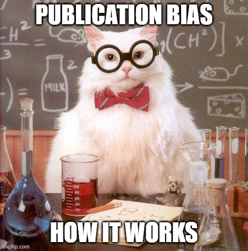

<style>
body {
text-align: justify}
</style>


```{r setup, include=FALSE, results='hide', warning=FALSE}
library(knitr)
opts_chunk$set(cache = FALSE,
               echo = TRUE,
               message = FALSE,
               warning = FALSE,
               dpi = 300)  
``` 

```{marginfigure}

```

Researchers working in the null hypothesis significance testing framework (NHST) are often unaware that statistically significant estimates cannot be trusted when their studies have a low statistical power. As explained by [Andrew Gelman and John Carlin (2014)](https://journals.sagepub.com/doi/full/10.1177/1745691614551642), when a study has a low statistical power (i.e., a low probability to get a statistically significant estimate), researchers have a higher chance to get statistically significant estimates that are inflated and of the wrong sign compared to the true effect size they are trying to capture. [Andrew Gelman and John Carlin (2014)](https://journals.sagepub.com/doi/full/10.1177/1745691614551642) call these two issues Type M (for magnitude) and S (for sign) errors. 

In this tutorial, we will try to understand why it happens and how we can take this issue into account. We simulate a fictional randomized experiment on the impact of fine particulate matters PM$_{2.5}$ on daily mortality to help researchers build their intuition on the consequences of low statistical power.


Should you find any errors and have any remarks, do not hesitate to reach me at leo.zabrocki@gmail.com.

# Loading Packages

To build the document and reproduce the analysis, the following packages are required: 

```{r}
library(here) # for file paths management
library(knitr) # for generating dynamic report
library(tidyverse) # for data manipulation and visualization
library(retrodesign) # for retrospective power analysis
library(lmtest) # for inference of estimated coefficients
library(sandwich) # for robust standard errors
library(DT) # for building nice table
library(Cairo) # for printing external fonts
source(here::here("script_theme_tufte.R")) # custom ggplot theme

# define nice colors
my_blue <- "#0081a7"
my_orange <- "#fb8500"
```

To carry out a retrospective power analysis, we need to install and load the package developed by [Andy Timm](https://andytimm.github.io/2019/02/05/Intro_To_retrodesign.html):

```{r, eval=FALSE}
install.packages("retrodesign")
```


# Setting-up the Experiment

Imagine that a mad scientist implements a randomized experiment experiment to measure the short-term effect of air pollution on daily mortality. The experiment takes place in a major city over the 366 days of a leap year. The treatment is an increase of particulate matter with a diameter below 2.5 $\mu m$ (PM$_{2.5}$) by 10 $\mu g/m^{3}$. The scientist randomly allocates half of the days to the treatment group and the other half to the control group. 

To simulate the experiment, we create a Science Table where we observe the potential outcomes of each day, i.e., the count of individuals dying from non-accidental causes with and without the scientist' intervention:

* We draw the distribution of non-accidental mortality counts $Y_i(0)$ from a Negative Binomial distribution with a mean of 106 and a dispersion of 38 (parameter `size` in the `rnbinom` function). The variance is equal to $\simeq$ 402. We choose the parameters to approximate the distribution of non-accidental mortality counts in a major European city.
* Our average treatment effect of the air pollutant increase leads to about 1 additional death, which represents a 1% increase in the mean of the outcome. It is a larger effect than what has been found in a very large study based on 625 cities. C. Liu *et al*. (New England Journal of Medecine, 2019) found that a 10 $\mu g/m^{3}$ in PM$_{2.5}$ was associated with an increase of 0.68% (95% CI, 0.59 to 0.77) in daily all-cause mortality.

```{r}
# set the seed
set.seed(42)

# create science table
data_science_table <-
  tibble(index = c(1:366), y_0 = rnbinom(366, mu = 106, size = 38)) %>%
  mutate(y_1 = y_0 + rpois(n(), mean(y_0) * 1 / 100))
```

We display below the Science Table:

```{r}
# display the science table
data_science_table %>%
  mutate(individual_treatment_effect = paste("+", y_1 - y_0)) %>%
  rename(
    "Index" = index,
    "Y(0)" = y_0,
    "Y(1)" = y_1,
    "Individual Treatment Effect" = individual_treatment_effect
  ) %>%
  datatable(., options = list(columnDefs = list(
    list(className = 'dt-center', targets = "_all")
  )))
```

And we plot below the full density distribution of the two potential outcomes:

```{r, fig.width=10, fig.height=5, fig.fullwidth = TRUE}
# plot the density distributions of the potential outcomes
graph_density_po <- data_science_table %>%
  rename("Y(0)" = y_0, "Y(1)" = y_1) %>%
  pivot_longer(cols = -c(index),
               names_to = "Potential Outcomes",
               values_to = "values") %>%
  group_by(`Potential Outcomes`) %>%
  mutate(mean_outcomes = mean(values)) %>%
  ggplot(. , aes(x = values, colour = `Potential Outcomes`)) +
  geom_density() +
  geom_vline(
    aes(xintercept = mean_outcomes, colour = `Potential Outcomes`),
    linetype = "dashed",
    key_glyph = "rect"
  ) +
  scale_colour_manual(values = c(my_blue, my_orange)) +
  xlab("Daily Count of Non-Accidental Deaths") + ylab("") +
  theme_tufte() +
  labs(colour = "Potential Outcomes:") +
  theme(axis.text.y = element_blank(),
        axis.ticks.y = element_blank())

# display the graph
graph_density_po
```

# Running the Experiment and Understanding its Inference Properties

In this section, we make the mad scientist run and analyze his experiment. We then show how to think about the inference properties of the experiment when one works in the null hypothesis testing framework.

### Running One Iteration of the Experiment

The scientist runs a complete experiment where half of the units are randomly assigned to the treatment. We display below the Science Table and the outcomes observed by the scientists. $W$ is a binary variable representing the treatment allocation (i.e., it is equal to 1 is the unit is treated and 0 otherwise) and $Y^{\text{obs}}$ is the potential outcome observed by the scientist given the treatment assignment.

```{r}
# we load the treatment assignment obtained by the scientist
data_scientist_treatment_assignment <-
  readRDS(here::here("data", "data_scientist_treatment_assignment.RDS"))

# display table
data_scientist_treatment_assignment %>%
  mutate(
    individual_treatment_effect = paste("+", y_1 - y_0),
    y_obs = w * y_1 + (1 - w) * y_0
  ) %>%
  rename(
    "Day Index" = index,
    "Y(0)" = y_0,
    "Y(1)" = y_1,
    "W" = w,
    "Individual Treatment Effect" = individual_treatment_effect,
    "Yobs" = y_obs
  ) %>%
  datatable(., options = list(columnDefs = list(
    list(className = 'dt-center', targets = "_all")
  )))
```   

The scientist then estimates the average treatment effect:

```{r}
# we compute the estimate of the treatment effect
scientist_result <- data_scientist_treatment_assignment %>%
  # express observed outcomes according to
  # treatment assignment
  mutate(y_obs = w * y_1 + (1 - w) * y_0) %>%
  # run simple linear regression
  lm(y_obs ~ w, data = .) %>%
  lmtest::coeftest(., vcov = vcovHC) %>%
  broom::tidy(., conf.int = TRUE) %>%
  filter(term == "w") %>%
  select(estimate, p.value, conf.low, conf.high)

# display results
scientist_result %>%
  mutate_all( ~ round(., 2)) %>%
  rename(
    Estimate = estimate,
    "p-value" = "p.value",
    "95% CI Lower Bound" = conf.low,
    "95% CI Upper Bound" = conf.high
  ) %>%
  kable(., align = rep('c', 4))
```   

He obtains an estimate for the treatment effect of 4.16 with a *p*-value of $\simeq$ 0.04. "Hooray", the estimate is statistically significant at the 5% level. The "significant" result fulfills the scientist who immediately starts writing his research paper.

### Replicating the Experiment

Unfortunately for the scientist, we are in position where we have much more information than him. We observe the two potential outcomes of each day and we know that the treatment effect is about +1 daily death. To gauge the inference properties of an experiment with this sample size, we replicate 10,000 additional experiments. We use the following function to carry out one iteration of the experiment:

```{r}
# first add the treatment vector to the science table
data_science_table <- data_science_table %>%
  mutate(w = c(rep(0, n() / 2), rep(1, n() / 2)))

# function to run an experiment
# takes the data as input
function_run_experiment <- function(data) {
  data %>%
    mutate(w = sample(w, replace = FALSE),
           y_obs = w * y_1 + (1 - w) * y_0) %>%
    lm(y_obs ~ w, data = .) %>%
    lmtest::coeftest(., vcov = vcovHC) %>%
    broom::tidy(., conf.int = TRUE) %>%
    filter(term == "w") %>%
    select(estimate, p.value, conf.low, conf.high)
}
```

We run 10,000 experiments with the code below:

```{r, eval = FALSE}
# run 1000 additional experiments
set.seed(42)

results_10000_experiments <-
  rerun(10000, function_run_experiment(data_science_table)) %>%
  bind_rows()

# make sound when code has finsished to run
beepr::beep(sound = 5)

# save simulation results
saveRDS(results_10000_experiments, here::here("data", "data_results_10000_experiments.RDS"))
```  

As it takes few minutes, we load the results that we already stored in the `data_results_10000_experiments.RDS` file in the `1.data` folder:

```{r}
# load results
data_results_10000_experiments <-
  readRDS(here::here("data", "data_results_10000_experiments.RDS"))

# add scientist's result
data_results_10000_experiments <-
  bind_rows(scientist_result, data_results_10000_experiments)
```  

As done by the [retrodesign](https://andytimm.github.io/2019/02/05/Intro_To_retrodesign.html) R package, we plot the estimates of all experiments and color them according to the 5% statistical significance threshold:

```{r, fig.width=10, fig.height=5, fig.fullwidth = TRUE}
# add iteration index
data_results_10000_experiments <- data_results_10000_experiments %>%
  mutate(iteration = 1:10001) %>%
  mutate(statistically_significant = ifelse(p.value <= 0.05, "True", "False"))

# make the graph
graph_experiment_results_dots <-
  ggplot(
    data_results_10000_experiments,
    aes(x = iteration, y = estimate, color = statistically_significant)
  ) +
  geom_point(shape = 16,
             size = 1,
             alpha = 0.6) +
  scale_color_manual(name = "Statistically Significant at the 5% Level", values = c(my_blue, my_orange)) +
  geom_hline(yintercept = 1,
             size = 0.5,
             colour = "black") +
  scale_x_continuous(breaks = scales::pretty_breaks(n = 10)) +
  scale_y_continuous(breaks = scales::pretty_breaks(n = 14)) +
  xlab("Iteration") + ylab("Estimate") +
  theme_tufte() +
  guides(colour = guide_legend(override.aes = list(alpha = 1, size = 3)))

# display the graph
graph_experiment_results_dots
```

We can see on this graph that statistically significant estimates overestimate the true effect size. Besides, a fraction of significant estimates are of the wrong sign! As an alternative visualization of the replication exercise, we also plot 100 point estimates with their 95% confidence intervals:

```{r, fig.width=10, fig.height=5, fig.fullwidth = TRUE}
# create the graph
graph_ci <- data_results_10000_experiments %>%
  slice(1:100) %>%
  mutate(iteration = row_number(),
         significant = ifelse(p.value <= 0.05, "True", "False")) %>%
  ggplot(.,
         aes(
           x = iteration,
           colour = significant,
           y = estimate,
           ymin = conf.low,
           ymax = conf.high
         )) +
  geom_hline(yintercept = 0, colour = "black") +
  geom_pointrange(lwd = 0.3) +
  scale_colour_manual(name = "Statistically Significant at the 5% Level", values = c(my_blue, my_orange)) +
  scale_x_continuous(breaks = scales::pretty_breaks(n = 10)) +
  scale_y_continuous(breaks = scales::pretty_breaks(n = 15)) +
  xlab("Iteration") + ylab("Estimate") +
  theme_tufte()

# display the graph
graph_ci
```       

### Computing Statistical Power, Type M and S Errors

To understand the inference properties of this experiment, we compute three metrics:

1. The **statistical power**, which is the probability to get a significant result when there is actually an effect.
2. The average **Type M error**, which is the average of the ratio of the absolute value each statistically significant estimate over the true effect size.
3. The probability to make a **Type S error**, which is the fraction of statistically significant estimates in the opposite sign of the true effect.

We consider estimates as statistically significant when their associated *p*-values are inferior or equal to 0.05. First, to compute the statistical power of the experiment, we just need to count the proportion of *p*-values inferior or equal to 0.05:

```{r}
# compute power
power <- data_results_10000_experiments %>%
  summarise(statistical_power = round(sum(p.value <= 0.05) / n() * 100, 0))
```

The statistical power of this experiment is equal to `r power`%. The scientist had therefore very few chances to get a "statistically significant" result. We can then look at the characteristics of the statistically significant estimates. We compute the average type M error or exaggeration ratio:

```{r}
# compute type m error
type_m <- data_results_10000_experiments %>%
  filter(p.value <= 0.05) %>%
  summarise(exageration_factor = mean(abs(estimate) / 1) %>% round(., 1))
```

On average, statistically significant estimates exaggerate the true effect size by a factor of about `r type_m`. We also compute the probability to make a type S error:

```{r}
# compute type s error
type_s <- data_results_10000_experiments %>%
  filter(p.value <= 0.05) %>%
  summarise(probability_type_s_error = round(sum(estimate < 0) / n() * 100, 1))
```

Nearly `r type_s`% of statistically significant estimates are negative! Working with such a sample size to detect an average effect of +1 death could lead to very misleading claims. Finally, we can also check if we could trust confidence intervals of statistically significant effects to capture the true effect size. We compute their coverage rate:

```{r}
# compute ci coverage rate
ci_coverage_rate <- data_results_10000_experiments %>%
  filter(statistically_significant == "True") %>%
  mutate(captured = ifelse(conf.low < 1 & 1 < conf.high, 1, 0)) %>%
  summarise(proportion_captured = mean(captured) * 100 %>% round(., 0))
```

Only `r ci_coverage_rate`% the intervals capture the true effect size! With lower power, the coverage rate of the confidence intervals of statistically significant estimates is much below its expected value of 95%.

# How Sample Size Influences Power, Type M and S Errors

Now, imagine that the mad scientist is able to triple the sample of his experiment. We add 732 additional observations:

```{r, echo=TRUE}
# set the seed
set.seed(42)

# add extra data
extra_data <-
  tibble(index = c(367:1098),
         y_0 = rnbinom(732, mu = 106, size = 38)) %>%
  mutate(y_1 = y_0 + rpois(n(), mean(y_0) * 1 / 100))

# merge with initial data
data_science_table <- bind_rows(data_science_table, extra_data) %>%
  # add treatment indicator
  mutate(w = c(rep(0, 549), rep(1, 549)))
```

We run 10,000 experiments for a sample of 1098 daily observations:

```{r, eval = FALSE}
# run 10000 additional experiments
set.seed(42)

results_large_sample_experiments <- rerun(10000, function_run_experiment(data_science_table)) %>%
  bind_rows()

# make sound when code has finished to run
beepr::beep(sound = 5)

# save simulation results
saveRDS(results_large_sample_experiments, here::here("data", "data_results_large_sample_experiments.RDS"))
```  

As it takes few minutes, we load the results that we have already stored in the `data_results_large_sample_experiments.RDS` file of the `1.data` folder:

```{r}
# load results
data_results_large_sample_experiments <-
  readRDS(here::here("data", "data_results_large_sample_experiments.RDS"))
```  

We plot the density distribution of the initial and new experiment:

```{r, fig.width=10, fig.height=5, fig.fullwidth = TRUE}
# add sample size indicator
data_results_10000_experiments <- data_results_10000_experiments %>%
  mutate(sample_size = "366 Observations")

data_results_large_sample_experiments <-
  data_results_large_sample_experiments %>%
  mutate(sample_size = "1098 Observations")

# draw density distribution of estimates
graph_estimates_large_sample <- data_results_10000_experiments %>%
  bind_rows(., data_results_large_sample_experiments) %>%
  ggplot(., aes(x = estimate, colour = fct_rev(sample_size))) +
  geom_density() +
  scale_color_manual(name = "Sample Size", values = c(my_blue, my_orange)) +
  scale_x_continuous(breaks = scales::pretty_breaks(n = 10)) +
  xlab("Estimates") + ylab("") +
  theme_tufte() +
  theme(axis.text.y = element_blank(),
        axis.ticks.y = element_blank())
```

We compute below the statistical power of this larger experiment:

```{r}
# compute statistical power
power_large_exp <- data_results_large_sample_experiments %>%
  summarise(statistical_power = round(sum(p.value <= 0.05) / n() * 100, 0))
```

The statistical power of this experiment is equal to `r `power_large_exp`%. We compute the average type M error:

```{r}
# compute type m error
type_m_large_exp <- data_results_large_sample_experiments %>%
  filter(p.value <= 0.05) %>%
  summarise(exageration_factor = mean(abs(estimate) / 1) %>% round(., 1))
```

On average, statistically significant estimates exaggerate the true effect size by a factor of about `r type_m_large_exp`. We also compute the probability to make a type S error:

```{r}
# compute type s error
type_s_large_exp <- data_results_large_sample_experiments %>%
  filter(p.value <= 0.05) %>%
  summarise(probability_type_s_error = round(sum(estimate < 0) / n() * 100, 1))
```

Nearly `r type_s_large_exp`% of statistically significant effects are negative! We finally check the coverage rate of 95% confidence intervals:

```{r}
# compute ci coverage rate
ci_coverage_rate_large_exp <-
  data_results_large_sample_experiments %>%
  filter(p.value <= 0.05) %>%
  mutate(captured = ifelse(conf.low < 1 & 1 < conf.high, 1, 0)) %>%
  summarise(proportion_captured = mean(captured) * 100 %>% round(., 0))
```

The coverage of 95% confidence intervals is equal to `ci_coverage_rate_large_exp`%.

With a sample size three times bigger, the statistical power of the experiment has increased but is still very low. Consequently, the exaggeration factor has decreased from `r type_m` to `r type_m_large_exp`. The probability to make a type S error has been reduced a lot and is close to 1. The coverage rate of confidence intervals has increased from `r ci_coverage_rate` to `r ci_coverage_rate_large_exp` but is still far from its 95% theoretical target.

# Retrospective Power Analysis

Given a range of hypothetical effect sizes and the standard error displayed in the articles, we can compute the statistical power and the probabilities to make type M and S errors using the [retrodesign](https://cran.r-project.org/web/packages/retrodesign/vignettes/Intro_To_retrodesign.html) package. 

### Study Details

Hong Chen, Qiongsi Li, Jay S Kaufman, Jun Wang, Ray Copes, Yushan Su, and Tarik Benmarhnia (2018) used a fuzzy regression discontinuity design to estimate the effects of the air quality alerts in Toronto, Canada, on health outcomes.

**Useful details on their study:**

* **Sample:** Their units are daily observations at the city-level over the 2003–2012 period. The sample size is equal to 143 observations.

**Authors' main results:**

* **Intention-to-treat analaysis:** Programme eligibility decreases daily emergency-department visits for asthma by 2.05 $\pm$ 0.99 cases.
* **Second-stage:** "Alert announcements reduced asthma-related emergency department
visits by 4.73 $\pm$ 2.37 cases per 1 000 000 people per day". This is a large effect as it represents in relative terms a 25% decrease.

### Assessing Power, Type M and S Errors

We explore here the statistical power, type M and S errors for the second-stage analysis:

```{r, fig.width=12, fig.height=5, fig.fullwidth = TRUE}
# compute the power, type m and s errors for a range of effect sizes
data_chen_iv_2018 <-
  retro_design(as.list(seq(0.05, 4.73, by = 0.01)), 2.37) %>%
  unnest() %>%
  mutate(power = power * 100,
         type_s = type_s * 100) %>%
  rename(
    "Statistical Power (%)" = power,
    "Type-S Error (%)" = type_s,
    "Type-M Error (Exaggeration Ratio)" = type_m
  ) %>%
  pivot_longer(
    cols = -c(effect_size),
    names_to = "statistic",
    values_to = "value"
  )

# graph annotations
data_annotation <-
  tibble(
    label = c(rep("95% CI Lower Bound", 3), rep("Half of the Estimate", 3)),
    statistic = rep(
      c(
        "Statistical Power (%)",
        "Type-S Error (%)",
        "Type-M Error (Exaggeration Ratio)"
      ),
      2
    ),
    effect_size = c(rep(0.0848, 3), rep(2.4, 3)),
    statistic_value = c(
      c(5.014667, 45.82731, 65.34801),
      c(17.32178, 0.8523015, 2.462447)
    )
  )

# make graph
graph_curves <-
  ggplot(data_chen_iv_2018, aes(x = effect_size, y  = value)) +
  geom_segment(
    data = data_annotation,
    aes(
      x = effect_size,
      xend = effect_size,
      y = 0,
      yend = statistic_value
    ),
    colour = my_orange,
    size = 0.5,
    linetype = "dashed"
  ) +
  geom_segment(
    data = data_annotation,
    aes(
      x = 0,
      xend = effect_size,
      y = statistic_value,
      yend = statistic_value
    ),
    colour = my_orange,
    size = 0.5,
    linetype = "dashed"
  ) +
  geom_line(colour = my_blue, size = 1.1) +
  geom_point(
    data = data_annotation,
    aes(x = effect_size, y = statistic_value),
    colour = my_orange,
    size = 4
  ) +
  geom_vline(xintercept = 4.73, colour = my_orange) +
  ggrepel::geom_text_repel(
    data = data_annotation,
    aes(x = effect_size, y = statistic_value, label = label),
    nudge_x = 2,
    nudge_y = 4,
    colour = my_blue,
    xlim = c(-Inf, Inf),
    ylim = c(-Inf, Inf)
  ) +
  facet_wrap( ~ statistic, scales = "free") +
  xlab("Hypothetical True Effect Size") + ylab("") +
  theme_tufte()

# display the graph
graph_curves
```

Imagine again that the true decrease in daily emergency-department visits for asthma was equal to the lower bound of the 95% confidence interval, i.e., 0.08. The statistical power would be equal to `r round(retro_design(0.08, 2.37)$power*100, 0)`% and the overestimation factor would be equal to `r round(retro_design(0.08, 2.37)$typeM, 1)`. Even if we take for a true effect size half of the estimate the authors found, the statistical power would be `r round(retro_design(2.4, 2.37)$power*100, 0)`% and the overestimation factor would be equal to `r round(retro_design(2.4, 2.37)$typeM, 1)`. For this study, the type M error is very worrying.
